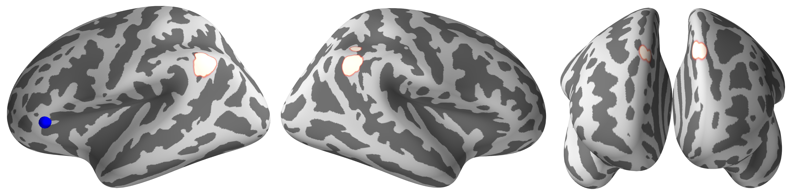

# Brain network of twitter replyer at rest

- Tweet collection: Python-twitter
- ROI to ROI / Seed to voxel analysis: CONN
- Graph theory analysis: CONN, Brain Connectivity toolbox
- Decoding analysis: Nilearn, Scikit-learn
- Visualization: CONN, Nilearn, PySurfer, Circlize, Matplotlib, Seaborn
