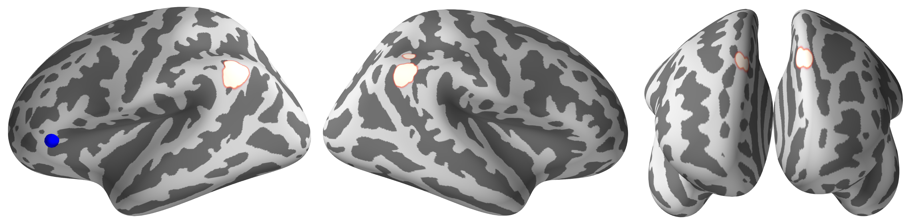

# Brain network of twitter replyer at rest
resting-fMRI analysis with twitter behavior

- ROI to ROI analysis was performed by CONN
- Seed to voxel analysis was performed by CONN
- Graph theory analysis was performed by CONN and BrainConnectivity toolbox
- Decoding analysis was performed by Nilearn and Scikit-learn
- Visualization was performed by CONN, Nilearn, PySurfer, and Circlize
